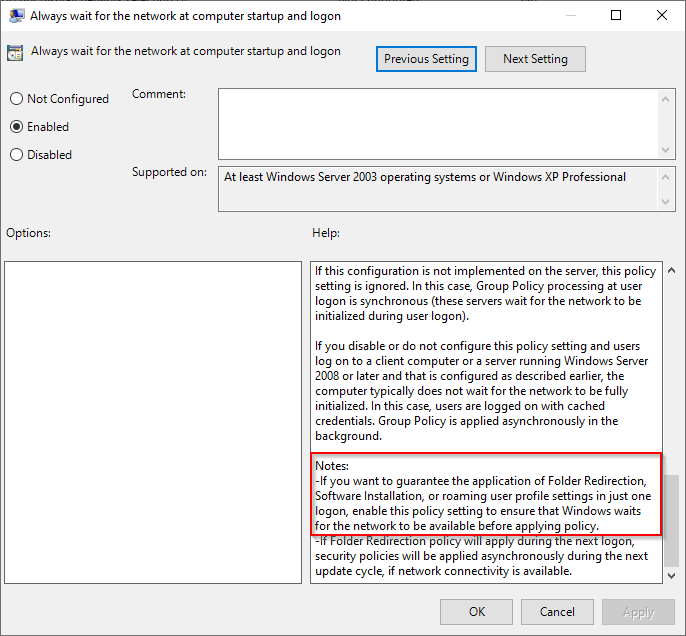
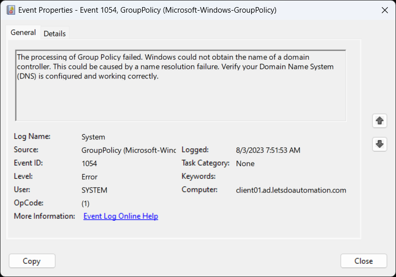
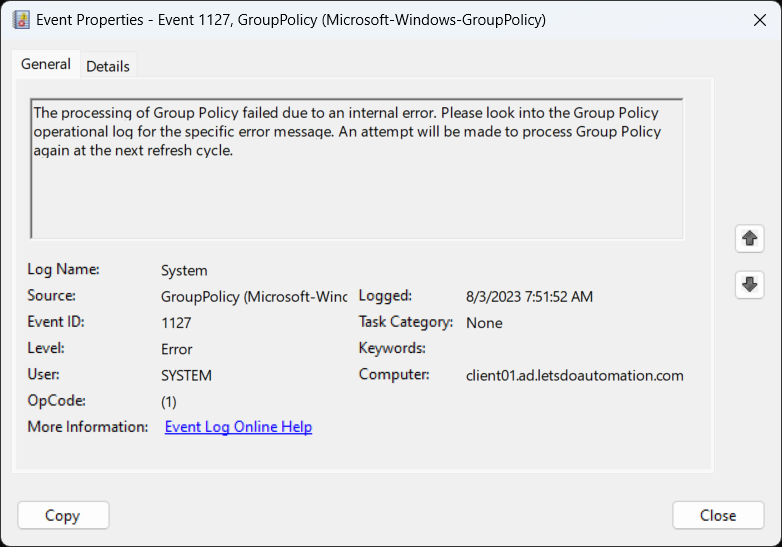

Computer Configuration > Administrative Templates > System > Logon > "Always Wait for the Network at Computer Startup and Logon" set to "Enabled".  

 "The processing of Group Policy failed. Windows could not obtain the name of a domain controller. This could be caused by a name resolution failure. Verify your Domain Name System (DNS) is configured and working correctly."  

 "The processing of Group Policy failed because of an internal system error. Please see the Group Policy operational log for the specific error message. An attempt will be made to process Group Policy again at the next refresh cycle."  

