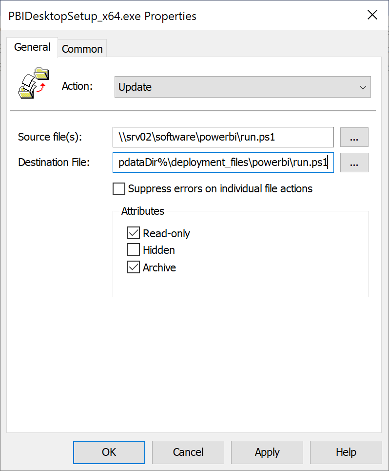
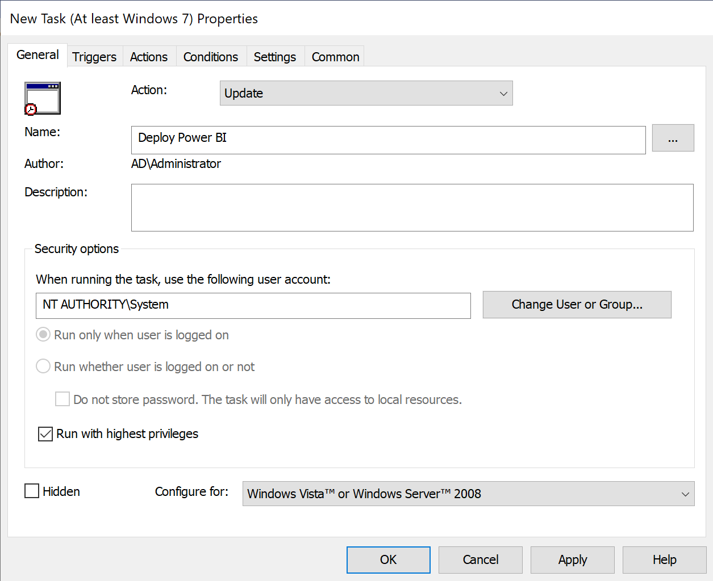

## Documentation and download
Download link: [Power BI](https://www.microsoft.com/en-US/download/details.aspx?id=58494)  
Documentation link: [Documentation](https://learn.microsoft.com/en-us/power-bi/fundamentals/desktop-get-the-desktop#use-command-line-options-during-installation)

## Path to File policy settings

<b>Policy path:</b> Computer Configuration > Preferences > Windows Settings > Files  

## For setup file deployment

<b>Source file(s):</b> \\\\srv02\software\powerbi\PBIDesktopSetup_x64.exe  
<b>Destination File:</b> %CommonAppdataDir%\deployment_files\powerbi\PBIDesktopSetup_x64.exe 

#### Item-level targeting
<b>Hive:</b> HKEY_LOCAL_MACHINE  
<b>Key path:</b> SOFTWARE\WOW6432Node\Microsoft\Microsoft Power BI Desktop  

##### AND
<b>Hive:</b> HKEY_LOCAL_MACHINE  
<b>Key path:</b> SOFTWARE\Microsoft\Microsoft Power BI Desktop  

## For script file deployment
<b>Policy path:</b> Computer Configuration > Preferences > Windows Settings > Files  

<b>Source file(s):</b> \\\\srv02\software\powerbi\run.ps1  
<b>Destination File:</b> %CommonAppdataDir%\deployment_files\powerbi\run.ps1  

#### Item-level targeting
<b>Hive:</b> HKEY_LOCAL_MACHINE  
<b>Key path:</b> SOFTWARE\WOW6432Node\Microsoft\Microsoft Power BI Desktop  

##### AND
<b>Hive:</b> HKEY_LOCAL_MACHINE  
<b>Key path:</b> SOFTWARE\Microsoft\Microsoft Power BI Desktop  

## Path to Scheduled Tasks policy settings

<b>Policy path:</b> Computer Configuration > Preferences > Control Panel Settings > Scheduled Tasks  

## For Scheduled Tasks deployment

<b>Name:</b> Deploy Power BI 
<b>When runing the task, use the following user account:</b> NT AUTHORITY\System

#### Action

<b>Program/Script:</b> powershell.exe  
<b>Add arguments(optional):</b> -ExecutionPolicy Bypass -File %ALLUSERSPROFILE%\deployment_files\powerbi\run.ps1 -Exe "%ALLUSERSPROFILE%\deployment_files\powerbi\PBIDesktopSetup_x64.exe" -ArgumentList "-silent -norestart ACCEPT_EULA=1" -Registry "HKLM:\SOFTWARE\Microsoft\Microsoft Power BI Desktop,HKLM:\SOFTWARE\WOW6432Node\Microsoft\Microsoft Power BI Desktop"  

#### Item-level targeting
<b>Hive:</b> HKEY_LOCAL_MACHINE  
<b>Key path:</b> SOFTWARE\WOW6432Node\Microsoft\Microsoft Power BI Desktop  

##### AND
<b>Hive:</b> HKEY_LOCAL_MACHINE  
<b>Key path:</b> SOFTWARE\Microsoft\Microsoft Power BI Desktop  

## For Scheduled Tasks removal

#### Item-level targeting
<b>Hive:</b> HKEY_LOCAL_MACHINE  
<b>Key path:</b> SOFTWARE\WOW6432Node\Microsoft\Microsoft Power BI Desktop  

##### OR
<b>Hive:</b> HKEY_LOCAL_MACHINE  
<b>Key path:</b> SOFTWARE\Microsoft\Microsoft Power BI Desktop  

## My enviroment setup
Group Policy and settings that i have configured in my servers and clients  
[Group Policy: Creating 32 and 64 bit WMI filters](https://youtu.be/ffBIiQaVXGM)  
[Group Policy: Always Wait for the Network at Computer Startup and Logon](https://youtu.be/8BF0rU7peNk)  
[Group Policy: Display highly detailed status messages](https://youtu.be/2LB51n4O1Lk)  
[Group Policy: Create an "Install a Program from the Network" desktop shortcut](https://youtu.be/s_pMiG0F0ho)  
My windows server setup:  
[Windows Server 2022: Install File Server role and prepare a share for software deployment with GPO](https://youtu.be/jEWSdC2qwyA)  
[Windows Server 2022: Install DHCP server](https://youtu.be/8n0MD9stQis)  
[Windows Server 2022: Install Active Directory Domain Services (AD DS)](https://youtu.be/1cYewbW3Tl0)  
