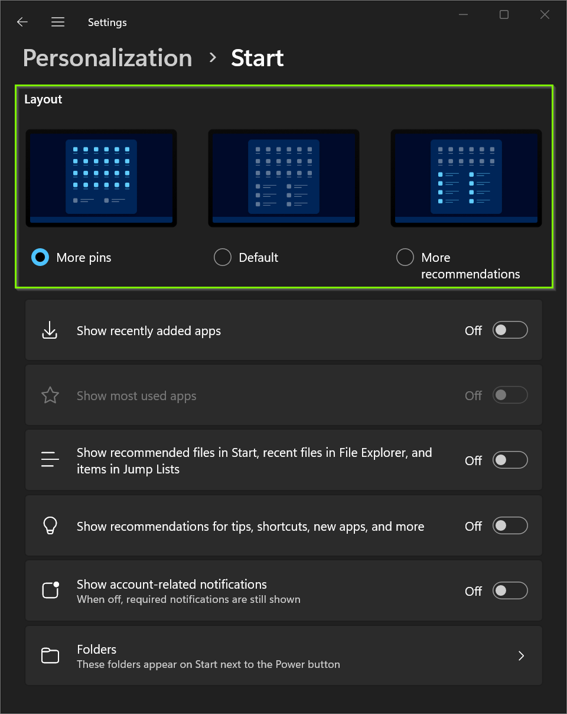

# Group Policy: Windows 11 configure Start layout more pins

<b>Objectives:</b>

<b>Policy location:</b> User Configuration -> Preferences -> Windows Settings -> Registry

<b>Anction:</b> Update  
<b>Hive:</b> HKEY_CURRENT_USER  
<b>Key Path:</b> SOFTWARE\Microsoft\Windows\CurrentVersion\Explorer\Advanced  
<b>Value Name:</b> Start_Layout  
<b>Value Type:</b> REG_DWORD  
<b>Value Data:</b> 0 - Default, 1 - More pins, 2 - More recommendations  

<b>My windows server setup:</b>  

* [Windows Server 2022: Install File Server role and prepare a share for software deployment with GPO](https://youtu.be/jEWSdC2qwyA)
* [Windows Server 2022: Install DHCP server](https://youtu.be/8n0MD9stQis)
* [Windows Server 2022: Install Active Directory Domain Services (AD DS)](https://youtu.be/1cYewbW3Tl0)
* [Create WMI filters for Windows 10 and Windows 11](https://youtu.be/7k_kpaLpMI8)